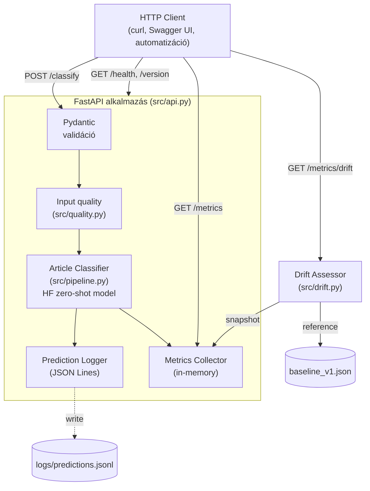

# Architektúra

## Projekt áttekintés

Az `article-classifier` egy zero-shot szöveg-osztályozó REST API: angol nyelvű
hírcikkeket sorol előre meghatározott kategóriákba (`world news`, `sports`,
`business`, `science and technology`, `politics`, `health`).

A háttérben a HuggingFace `facebook/bart-large-mnli` modell fut. A modell
nem cikkek-kategóriák párokon van tanítva — a NLI (Natural Language
Inference) feladaton lett tréningelve, és a zero-shot pipeline ezt a
képességet hasznosítja újra szöveg-osztályozásként.

## Miért zero-shot, és nem fine-tuned modell?

A klasszikus megközelítés egy adott kategória-készletre fine-tuneolt
osztályozó: nagy, címkézett dataset, GPU-órák, és minden új kategória
újratanítást igényel. A zero-shot megközelítés trade-off-okat csinál:

| Szempont | Fine-tuning | Zero-shot |
|---|---|---|
| Címkézett training adat | Sok ezer példa | Nincs (csak eval) |
| Új kategória felvétele | Retraining | Konfigurációs változás |
| Pontosság (kategóriában) | Általában jobb | Általában gyengébb |
| Indulási költség | Magas | Alacsony |

Ennek a projektnek nincs címkézett training-adat (a projekt scope-ja
miatt), és a kategória-készlet könnyű változtathatósága üzleti előny:
egy hírportál szerkesztősége ma `world news` címkét akar, holnap `climate`-et,
holnapután `AI`-t — a fine-tuning ciklus erre lassú. Zero-shot mellett
a label-set egy verziózott JSON fájl: `data/prompts/labels_v1.json`.

A trade-off a pontosság: a baseline-mérés szerint az AG News stratifikált
eval seten az accuracy 55%, ami egy fine-tuneolt BERT-osztályozónál
gyengébb (~92-94% szokott lenni AG News-on). Ez tudatos vállalás. A
monitoring rendszerben a confidence-küszöb és a `low_ratio` metrika
explicit módon számon tartja, mennyi predikció bizonytalan.

## Az NLI-trükk: hogyan lesz egy NLI-modellből osztályozó?

Az NLI feladata: két mondatpárról eldönteni, milyen logikai viszonyban
állnak (entailment / contradiction / neutral). A bart-large-mnli pontosan
erre lett tanítva a [MultiNLI](https://huggingface.co/datasets/nyu-mll/multi_nli)
korpuszon (~412k mondatpár).

A zero-shot trükk Joe Davison ([HuggingFace](https://joeddav.github.io/blog/2020/05/29/ZSL.html))
megfigyelése: minden kategória-címke átformulálható egy NLI hipotézissé.

Példa:
- **Premise** (a cikk szövege): "The Lakers defeated the Celtics 112-104 in overtime."
- **Hypothesis** (a sablon): `"This text is about {label}."`
  - "This text is about sports." → entailment score: 0.92
  - "This text is about politics." → entailment score: 0.08
  - "This text is about business." → entailment score: 0.05

A legmagasabb entailment-pontszámú címke nyer. A zero-shot pipeline
mindezt egyetlen `classifier(text, labels)` hívással elintézi.

A `hypothesis_template` a `data/prompts/labels_v1.json`-ben verziózva
van — ha más sablon (pl. `"This article belongs to the {} category."`)
jobb lenne, az egy új `labels_v2.json` lenne.

## Komponens-struktúra



ASCII-változat (text-only környezethez):

```
┌─────────────────┐
│  HTTP Client    │ (curl, Swagger UI, automatizáció)
└────────┬────────┘
         │ POST /classify
         ▼
┌─────────────────────────────────────────────────────────┐
│  FastAPI (src/api.py)                                    │
│  ┌──────────────┐  ┌──────────────┐  ┌──────────────┐  │
│  │ Pydantic     │→ │ Quality      │→ │ Pipeline     │  │
│  │ validation   │  │ assessment   │  │ (HF model)   │  │
│  └──────────────┘  └──────────────┘  └──────────────┘  │
│                          │                  │           │
│                          ▼                  ▼           │
│                  ┌──────────────┐  ┌──────────────┐    │
│                  │ Prediction   │  │ Metrics      │    │
│                  │ Logger       │  │ Collector    │    │
│                  │ (JSONL file) │  │ (in-memory)  │    │
│                  └──────────────┘  └──────────────┘    │
└──────────────────────────┬───────────────┬──────────────┘
                           │               │
                  GET /metrics/drift  GET /metrics
                           │               │
                           ▼               ▼
                  ┌────────────────────────────────┐
                  │ Drift assessor (src/drift.py)  │
                  │   ↑ baseline_v1.json           │
                  └────────────────────────────────┘
```

### Modulok

| Modul | Felelősség |
|---|---|
| `src/pipeline.py` | A HF zero-shot pipeline becsomagolása, truncation, verzió-info |
| `src/api.py` | FastAPI alkalmazás, endpoint-ok, dependency injection |
| `src/schemas.py` | Pydantic modellek (request, response, error) |
| `src/config.py` | Központi konfig (paths, modell, küszöbök) |
| `src/monitoring.py` | In-memory `MetricsCollector` ring buffer (capacity=1000) |
| `src/prediction_logger.py` | Append-only JSON Lines logger (PII-mentes) |
| `src/quality.py` | Heurisztikus input-minőség ellenőrzés |
| `src/drift.py` | KL-divergencia és per-label drift assessor |

## Telepítési modellek

### 1. Helyi fejlesztés
```bash
python -m venv .venv && source .venv/bin/activate
pip install -r requirements.txt
uvicorn src.api:app --reload
```
A modell betöltése MPS-en (Apple Silicon) ~5 másodperc, predikció ~250 ms.

### 2. Docker (jelenlegi production-szerű)
```bash
docker compose up
```
A `Dockerfile` multi-stage build: a final image (~4.85 GB) tartalmazza
a pre-downloaded modellt, így a konténer azonnal készen áll. CPU-only
torch (Linux konténerben nincs MPS), ezért a latency ~1100-1700 ms.

### 3. Serverless (lehetséges jövőbeli irány)

A jelenlegi architektúra nem alkalmas közvetlen FaaS-deploymentre
(AWS Lambda, Cloud Functions): a modell ~3 GB, a cold-start ~30+ másodperc
lenne, és a memória-limit (Lambda: 10 GB max) szűkös. Két reálisabb opció:

- **Container-orchestration platform** (AWS App Runner, Cloud Run, ECS Fargate):
  a Docker image változatlan, a platform horizontálisan skálázza. Az
  életciklus megegyezik a docker-compose-éval, csak a runtime-ot a felhő
  managed szolgáltatása biztosítja.

- **Hosted inference** (HuggingFace Inference Endpoints, AWS SageMaker):
  a modell-rétegét kiszervezzük egy inference-szolgáltatóhoz, és csak az
  API-réteg (FastAPI) marad serverless. A `src/pipeline.py` ekkor egy
  HTTP-kliens lenne a HF Endpoint felé, az `src/api.py` és minden
  monitoring változatlanul futna FaaS-en (kis cold-start, kicsi image).

A választás a forgalom-mintázattól függ: alacsony, sporadic forgalom →
hosted inference; magas, állandó forgalom → managed konténer-platform.

## Kulcs döntések

- **Pre-trained, nem fine-tuneolt modell**: a zero-shot rugalmasság
  nagyobb érték a projekt skáláján, mint a +30 százalékpont accuracy.
- **In-memory metrika-gyűjtő, nincs Redis/Postgres**: a recent window
  egyszerű, és a JSON Lines logok perzisztensek — egy külső eszköz
  (Loki, ELK) ezekből rekonstruálni tudja a teljes történetet.
- **Truncation a tokenizer-szinten**: a HF pipeline alapból nem ad
  visszajelzést a truncation-ról, ezért explicit kezeljük és minden
  válaszba beágyazzuk a `truncated` flag-et.
- **PII-mentes logok**: az input szöveg helyett SHA-256 első 16 karaktere
  kerül a logba — visszakeresésre (egyezés-keresés) elég, GDPR-szempontból
  biztonságos.
